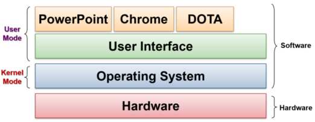
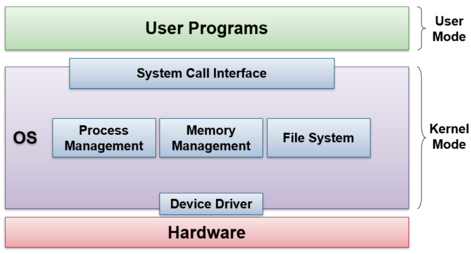
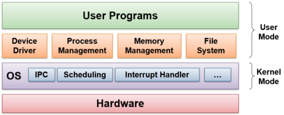
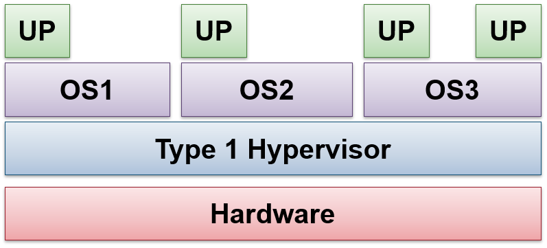
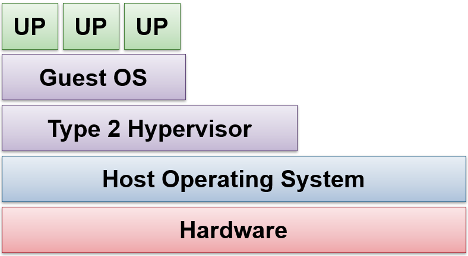

## A. Operating Systems Basic Concepts
> An **operating system** is a *program* that acts as an intermediary between a user and computer hardware
- hardware itself
- user (can be a person, or application programs)

- OS can exist on computers or laptops, smartphones and other hardware (i.e. game consoles and home appliances)
### A1. The first computers
- they had no Operating Systems (i.e. the user program **directly interfaces** with hardware)
	- re-programming is made by changing the physical configuration of hardware
##### Advantage:
- having minimal overhead
##### Disadvantage:
- programs written are not portable
- is an inefficient use of the computer

### A2. Mainframes
**Mainframes** have:
- *no* interactive interface
- accept programs in the forms of paper and magnetic tape, as well as punch cards
- only supports batch processing
- are very costly and are usually rented instead of owned (unlike computers today)
##### Properties
- uses a batch OS which executes user programs (i.e. jobs) **one at a time,** successively
- user jobs still **interact with the hardware directly** but with *additional information* from the OS
##### Improvements Required
- Simple Batch processing is inefficient $\implies$ CPU has idle time waiting for I/O operations to be completed
	- use of multiprogramming or time-sharing to make full use of this idle time
### A3. Multiprogramming
- running multiple programs with the same CPU
- w/o it, users can cannot keep the CPU and I/O devices busy at all times
- increases CPU utilization by organizing jobs so that the CPU is occupied most of the time $\implies \uparrow$ efficiency
- does not allow user interaction with the computer system
### A4. Time-sharing
- allows **many users** to interact using terminals (i.e. `tty`) while the program is still running
	- requires an interactive system to provide direct communication (i.e. user $\leftrightarrow$ computer)
	- $\exists$ a time gap between the user and the system since the CPU is much faster than the user
	- technologies used to accomplish this is CPU scheduling $+$ multiprogramming
	
- user **job scheduling** provides the illusion of concurrency by switching amongst different jobs very frequently and quickly

- handles CPU time, memory and storage (has features for memory and storage management etc.) $\implies$ sharing of these resources is also possible

- **hardware virtualization** where each program or process can execute as if it has **all the resources to itself**

- a.k.a. *multitasking*

**Examples**: CTSS developed @ MIT and Multics, the precursor to Unix
- pushing the virtual memory and security technologies
### A5. Minicomputer & Unix
- Minicomputer is modelled after the mainframe, but it is a smaller and cheaper version 
	- Example: Digital Equipment Corp PDP-11

- Unix was developed by AT&T employees
- the API is the same most of the time
- has a simple architecture
- the internals are well understood

- some variants are open-source

### A6. OS on Personal Computer
- each machine is dedicated to a user, which gives rise to the personal OS
- different models $\to$ Single User (i.e. Windows) and General Time Sharing (Unix)

---
## B. Motivation for Operating Systems
### B1. Abstraction
- $\exists$ large variation in hardware configurations
	- hard disks can have different capacities and capabilities (i.e. store different formats?)

- However, hardware in the same category is well-defined and has common functionality

- choose to hide the low-level implementation details from the user
	- users can choose to perform tasks w/o having concern about low-level implementations
	- simplifies programming through exposure of API calls

- presents a common high-level functionality to the user instead

- provides efficiency and portability
### B2. Utility as a Resource allocator & manager
- program execution requires many resources, which OS provides out of the box
	- management and sharing of resources
	- arbitrates potentially conflicting requests from various processes (to ensure efficient and fair resource usage)
	- enables for process synchronization

- under the condition that multiple programs should be able to **execute simultaneously**

### B3. Control Program
- prevents the misuse of the computer's hardware resources due to accidental bugs and malicious uses

- multiple users could share the computer and it is tricky to ensure a separate user space for each of them

- controls the execution of programs by preventing errors and providing security
	- enforcement of usage policies

- allows for program portability across different hardware implementations
---
## C. Operating System Structures
- implementation of the OS describes the best way of providing the capabilities or functionalities
- structure of the OS describes the organization of various components
- important to OS to be *flexible, robust and easily maintained*
	
##### The OS as a program
- OS is known also as kernel
- is a program with some special features as it 
	- deals with hardware issues
	- provides the system call interface ($\neq$ hardware API)
		- is the interface between user and kernel modes
	- has special code for interrupt handlers and device drivers

- Kernel code is quite different from programs running on the OS itself
	- cannot use system calls, default library functions and I/O functions as well

### C1. Implementing the OS
1. Programming language
	- historical implementation in assembly language, now in higher-level languages like C++
	- heavily dependent on hardware architecture

2. Common Code Organization
	- implementation in machine-independent high level language, machine-dependent high level language or machine-dependent asm

3. Challenges of implementations
	- no APIs to call
	- debugging is hard since the code is complex and the codebase is large

### C2. OS Structure Types
1. **Monolithic**
	- the kernel is one big special program
	- good software engineering principles are possible 
	- traditional approach taken by most Unix variants and Windows NT
		

2. **Microkernel**
	- is very small and clean
	- only provides basic and essential facilities such as inter-process communication (IPC)
		

3. **Layered**
	- is the generalization of monolithic systems
	- can organize the components into hierarchy of layers
		- upper layers make use of lower layer's services
		- lowest layer is the hardware and the highest layer is the user interface

4. **Client-Server Architecture**
	- is a variant of the microkernel where there are two classes of processes
		- client processes request services
		- server process is built on top of the microkernel
		- client and server processes can be on distinct machines

5. **Exokernel**

---
## D. Virtualization
### D1. Motivation
- OS assumes total control of the hardware, but not really possible to run multiple OSes on the same hardware

- OS is hard to debug and monitor
	- how to observe the workings of an OS
	- how to test destructive operations?

> The **virtual machine** is a software emulation of the underlying hardware
- normal OS can then run on top of a VM
- VM is also known as a *hypervisor* with two implementation classes

| Type 1                                              | Type 2                                                                      |
| --------------------------------------------------- | --------------------------------------------------------------------------- |
| provides individual VMs to guest OSes               | runs on the host OS and $\forall$ guest OSes run inside the Virtual Machine |
|  |                          |