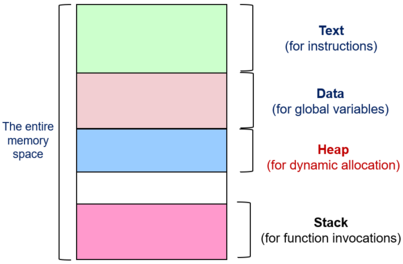

## A. Intro to Process Management
### A1. Motivation
- OS is expected to have efficient use of the hardware resource (managing programs executing on hardware)
- how do we utilize hardware resources effectively if **only when program executes at a time** (no concurrency)
	- allow for multiple programs to *share* the *same hardware processes*
### A2. Properties
- Program switching by the OS requires the following
	- information regarding execution of program A (to be stored)
	- replacing program A's info with that of program B

> A **process** requires an abstraction to describe a running program

**Topics**
1. *Process Abstraction* - info describing an executing program
2. *Process Scheduling* - deciding which process gets to execute, when
3. *Inter-process Communication & Synchronization* - passing info btwn processes
4. *Threads* - a.k.a. a lightweight process
## B. Process Abstraction
- a process, task or job is a dynamic abstraction for executing programs
	- has information required to describe running programs

- *Memory Context:* contains code and data
	- storage for instruction & data

- *Hardware Context:* contains register and program counter $PC$

- *OS Context:* contains process properties and the resources used

	
### B1. Component Descriptions
- *Memory* (RAM)
	- storage for instruction and data (as above)

- *Cache*
	- is a duplicate of memory inside the CPU for faster access
	- usually split into *instruction cache* and *data cache*

- *Fetch Unit* (IF)
	- retrieves instructions and load into Instruction memory
	- location is indicated by the special register: *Program Counter* $PC$

- *Functional Units* (EX)
	- carry out the instruction execution
	- dedicated to different instruction type

- *Registers*
	- internal storage for the faster access speed
	- **General Purpose Register** ($GPR$): accessible by user program that is visible to the compiler
	- **Special Registers**
		- Program Counter ($PC$)
		- Stack Pointer ($SP$)
		- Frame Pointer ($FP$)
		- Program Status Word ($PSW$) $\implies$ status bits reflecting the current CPU state
### B2. Basic Instruction Execution
**Sequence**
1. Instruction $X$ fetched (with memory location indicated by $PC$)
2. Instruction $X$ dispatched to the corresponding functional unit
	1. read operands from memory or $GPR$
	2. results computed at ALU
	3. write result value if applicable to memory or $GPR$

3. Instruction $X$ completes execution and $PC$ updated for the next instruction

**Components**
- binary executable consists two major components: instructions and data
- information generated during program execution
	- **Memory Context**: *text, data, stack and heap*
		- there are many other types of memory usages as well
	- **Hardware Context**: $GPR$, $PC$, `$sp`, `$fp` etc.
	- **OS Context:** Process ID, Process State etc.
## C. Function Calls
- need to decide how to allocate memory space for variables `i`, `j` and `a`?
	- can make use of the **data** memory space

	
### C1. Issues
- control flow
	- need to jump to function body and resume when the function call is done
	- minimally, need to store the $PC$ of the caller

- data storage
	- need to pass parameters to the function 
	- need to capture the `return` result
	- have local variables declaration

**Steps**
1. setup the parameters (passed in from callee)
2. transfer control to the callee
3. set up local variables
4. store result where applicable
5. return to caller

```c
void f(int a, int b)
{ 
	int c;
	c = g(a, b);  // 1
	...
}

int g(int i, int j)
{
	int a;  // 3
	...
	return ...;  // 4
}
```

- require new memory region that is dynamically used by function calls
### C2. Intro to Stack Memory
- new memory region store info for function invocation $\implies$ is a special area of memory used for the storage for **temporary values**
	- last in first out data structure
	- useful when we don't have enough registers for storing essential values, especially when calling other subroutines

- info of function invocation is described by a stack frame
	- `return` address
	- arguments passed to function
	- storage of local variables

- allows for more than $4$ parameters and $2$ return values to be stored at once

- contains *automatic variables* (upon the invocation of a function)
##### Stack Pointer `$sp`
- points to the top of the stack region (the first unused location)
	- most CPU has a specialized register for this purpose
	- holds the **last thing** that we have pushed into the stack
	- is the memory address of the current push or pop operation

- memory accesses are done via `lw` and `sw` instructions
	- `$sp` is used as the base address for these memory-related instructions

- by convention, we move the stack pointer **before we storing data** with `sw` and **after loading data** with `lw`

**Push Instruction**
- recall that stack grows upwards towards *smaller addresses*, so need to decrement address stored inside stack pointer by a word (since $1$ word $= 32$ bits in MIPS)
- value stored in `$t4` is what we wish to store temporarily (before being retrieved using `lw`)
```python
addi $sp, $sp, -4   # 0xABCD -> 0xABC9
sw   $t4, 0($sp)
```

**Pop Instruction**
```python
lw $t4, 0($sp)
addi $sp, $sp, 4
```

**Operations**
- stack frame is added on (the top) or pushed when the function is invoked $\implies$ the stack grows taller* $\implies$ grows to higher memory addresses
- stack frame is removed (popped) when the function execution completes $\implies$ stack shrinks*
- note that the memory layout of some systems are flipped (stack on top, text at bottom)

	

##### Stack Frame Diagram Version 1
- there are *different ways* to setup the stack frames
	- no universal way as it is hardware and programming language requirement
- stack frame is an organized section of the stack containing registers to be preserved by the procedure


##### Setup Process
1. **Prepare** to make a function call (Caller)
	- pass parameters with the registers and / or stack
	- save the return $PC$ in `$ra` $\implies$ where to point too after Callee completes execution
		- get back to old location as indicated by the $PC$ after procedure calls
		- update $PC$ value to new offset or label memory location
 
2. **Transfer control** from the caller **to the callee** (Callee)
	- save the the registers used by the callee function, old stack pointer and frame pointer
	- allocate space for local variables of the callee function on the stack itself
	- adjust $SP$ to point to the new stack
		- position of saved $SP$  is between parameters and the `return` $PC$

##### Teardown Process
1. **Return** from the function call (Callee)
	- place the *return result*  (ret value) onto the stack where applicable, unless we are returning `void`
	- restore to the saved Stack Pointer $SP$ value, Frame Pointer $FP$ and saved registers (see below)

2. **Transfer** the **control back to the caller** using the saved $PC$ value (Caller)
	- utilize the return result, where applicable (which is the result produced)
		- can use the MIPS instruction `jr $ra`, which updates $PC$ back to the old location, i.e. the location of the caller
	- continues execution from the caller function
	
		
##### Other Information in Stack Frame
1. **Frame Pointer** `$fp`
	- used to access various stack frame items, since stack pointer is hard to use (inherently $\Delta$)
	
	- some processors provide the Frame Pointer as a dedicated register $\implies$ `$fp` usage is platform dependent

	- frame pointer points to a **fixed location** in a stack frame
		- other items are accessed using frame pointer as reference (**relative displacement** from the `$fp`)
		- is **static** within the *context of a single procedure call* (has one caller and one callee only)
		- points to the bottom of the **current stack frame**

2. **Saved Registers** 
	- *a.k.a. Callee-saved registers or register spilling*
	
	- since the general purpose registers of most processors are severely limited, can use memory to temporarily hold the register values
		- MIPS has $32$ GPRs and x86 has $16$ GPRs

	- can use GPRs for other purposes and then restored after the operation to be performed is completed
		- function can spill registers that it intends to use before the function is executed and then *restore* those registers after it completes
		- related to the scoping of variables, particularly in the context of **function-local variables** and **variable lifetimes**
		- used to maintain the **correctness** of programs
	
	- is located inside the *register file or the stack* and can be used by the compiler

##### Stack Frame Diagram Version 2
- *parameters* are to be **passed into** the callee function and *return value* are to be **passed out** of the callee function, back to the caller for further computation
	- the return values could be a modified version of the parameters (if any), or that the return value depend on the parameters supplied
	- can use `$ax` where $x \in \{1, 2, 3\}$ to store arguments or parameters, which should be assumed to stay the same (i.e. the callee function should **not** act on these) $\implies$ `$ax` are stable / don't change, while `$vx` could change (i.e. they are variable)
		- responsibility of saving value in `$ax` lies on the callee function

- data in the stack frame can be accessed relative to the values stored inside `$fp` or `$sp`
	- advantage of using the `$fp` instead is consistent static access (predictable)

**Stack frame for function `g()`**
- we can store the saved `$fp` value for function`f()`, so that we can reference it again later on
- also stores any saved registers that we want to reference upon returning to function `f()`
- allocation of space for local variables which callee function `g()` can use


## D. Dynamically Allocated Memory
- most programming languages support dynamically allocated memory $\implies$ the allocation of memory during execution or run time

- Examples
	- `malloc()` function call in C
	- `new` keyword in Java / C++ to initialize 
#### Motivation
- cannot use **data** or **stack** memory because of
	- allocation of memory only at runtime, no static memory address location $\implies$ cannot place into **data** memory region
	- no definite deallocation timing $\implies$ cannot place in **stack** memory region

- require a separate space to store these dynamically allocated items, contains the "data" maintained by `malloc()` and `free()`
	- usually used for pointer variables
	- is shared amongst all threads, shared libraries and DLL modules

	

#### Managing Heap Memory
- harder, given the variable size of data that is stored inside the heap
- there is a variable allocation and deallocation timings, as compared with stack and data memory
	- must be explicitly managed using `malloc()` and `free()` calls (instead of manual push and pop in the stack when a function is invoked / returns)

- $\exists$ a tricky scenario where heap memory is (de)allocated to create holes $\implies$ underutilization as we are not using contiguous chunks of memory
	- free memory could be squeezed in between occupied memory blocks
## E. Processes
### E1. Process ID (PID)
- used to distinguish processes, to be a unique identifier

- some OS dependent issues
	- PID reuse (after a lease expires?)
	- is there a limited to the maximum no. of processes
	- reserved PIDs
### E2. Process State
> The **process state** indicates the status of execution of a given process

- in multitasking scenario, processes can have two states -- running or not running
- but process can be "ready to run", but is **not actually executing**
##### Process Model State Diagram
- the *set of states and transitions* are known as the process model

1. **New:** new process created, may still be under initialization
2. **Ready:** the process is *waiting to run*
3. **Running:** the process is *being executed* on the CPU itself
4. **Blocked:** a process is waiting or sleeping for an event, until the event is available
	- example: I/O operations, awaiting input or syscalls
5. **Terminated:** process has finished execution but may require OS clean-up
##### State Transitions
1. **Create** (NIL $\to$ New): new process creation
2. **Admit** (New $\to$ Ready): process is ready to be scheduled for running
3. **Switch - Scheduled** (Ready $\to$ Running): process selected to run (from waiting state)
4. **Switch - Release CPU** (Running $\to$ Ready): process gives up CPU time voluntarily or pre-empted by the scheduler
5. **Event wait** (Running $\to$ Blocked): process requests for event that is not available or still in progress
	- system call or awaiting for I/O
6. **Event occurs** (Blocked $\to$ Ready): process can continue execution

- each process may be in different states, with each process in different part of the state diagram
##### View of Process States
Given $n$ processes
- with $1$ CPU, $\exists \leq 1$ process in the running state, with conceptually $1$ transition at a time
- with $m$ CPUs, $\exists \leq m$ processes in the running state, with possible for parallel transitions
##### State Transitions
- $\geq 1$ process can be in the ready and blocked queues at once
- we can have separate event queues

### E3. Process Control Block (PCB)
- PCB contains the entire execution context for a process
- the kernel maintains the PCB for each individual process
	- conceptually stored as a single table for all processes on a machine

**Issues**
- scalability: how many concurrent processes can we have
- efficiency: how do we provide efficient access to each block, with minimal space wastage

	
## F. Process interaction with Operating Systems
### F1. System Calls
- are essentially an API call to the OS, which provides a way of calling facilities or services provided by the kernel
- is **not the same** as a normal function call as have to go from user to kernel modes

- different OSes have different APIs
	- **UNIX variants:** follow the POSIX standards
	- **Windows variants:** uses the Windows API across different Windows versions
		- usually has a huge number of API calls

- system calls can be involved almost directly *as long as*:
	- **library version has the same name** and same parameters (acts as a function wrapper)
	- **user-friendly library version** which acts as a **function adapter**
	
- included via the `unistd.h` header file, which contains the POSIX APIs
	- based on the example below, `getpid()`, `write()` which is made by `printf()` are syscalls
```c
#include <unistd.h>
#include <stdio.h>
int main()
{
  int pid;
  pid = getpid();

  printf("process id = %d\n", pid);
  return 0;
}
```
### F2. Syscall Mechanisms
1. User program invokes library call, using a normal function call mechanism
2. Library call places the system call number in a designated location (i.e. in a register, usually in argument register 0 or `$a0`)
3. Library calls executes special instruction to switch from user mode to kernel mode (i.e. `TRAP`)
4. Call the appropriate system call handler in kernel mode
	- use the system call number as index
	- this is handled by the dispatcher

5. System call handler is executed (fulfilment of the request)
6. System call handler ends, which returns control to the library call
	- switching from kernel back to user mod happens here

7. Library call return to user program (via normal function return mechanism)


### F3. Exceptions
- could occur when executing a machine-level instruction
- exceptions are synchronous and occur due to program execution

**Examples**
1. Arithmetic Errors $\to$ Overflow, Underflow, Zero Division
2. Memory Access Errors $\to$ illegal memory address, misaligned memory access (i.e. a word not aligned to a word-sized boundary)

**Effects**
- have to execute exception handler, which is like a forced function call $\implies$ control should be transferred to the handler automatically
### F4. Interrupts
- external events (not the logic) that could interrupt the execution of programs
- usually hardware related (i.e. timer, mouse movements, key pressed)
- are asynchronous, which means that these events are **independent of program execution**

**Effects**
- program execution is suspended
- have to execute an interrupt handler
