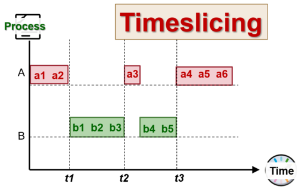
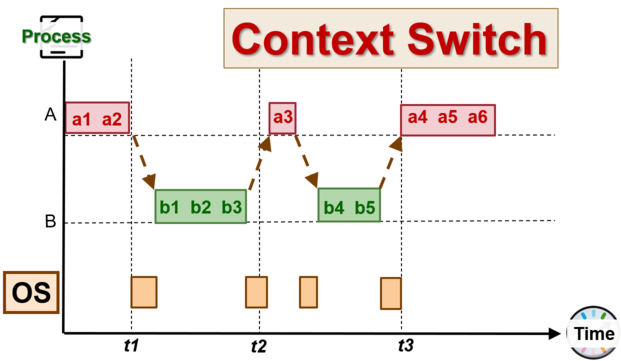

## A. Concurrent Execution
- concept for multi-tasked processes
	- virtual or physical parallelism $\implies$ assume both of them are the same 

| Concurrency via Time-slicing              | Interleaved Execution via context switching           |
| ----------------------------------------- | ----------------------------------------------------- |
|  |  |
##### Types
- $\mathbf{1}$ **CPU** is time-sliced for the execution of $n$ tasks
- **Multiprocessor:** the timeslicing occurs on $m$ CPUs
## B. Process Scheduling
- **The scheduling problem:** having $n$ tasks or processes and only $m$ CPUs occur when $n \gt m$
	- same concept can be applied on the thread level as would be the same

- A typical process goes through the *phases* of:
	- **CPU Activity:** computation like number crunching
	- **I/O Operations**: requesting and receiving services from I/O devices
		- majority of the time is spent as I/O bound process

### B1. Definitions & Terminology
1. Scheduler: the part of the OS that makes the scheduling decision
2. Scheduling Algorithm: self-explanatory (selects the process to run and allocate the CPU)

- each process has different requirements of the CPU time that it requires, based on **process behaviour**
	- process environments are considered by the scheduling algos
### B2. Types of processing environments
1. Batch processing $\to$ **no user interaction required** and no need to be responsive
2. Interactive $\to$ with active user interacting w system, should be responsive and consistent with response time
3. Real-time processing $\to$ has a deadline to meet and usually takes the form of a periodic process
### B3. Criteria
- many criteria for evaluating scheduling algorithms
- criteria for all processing environments
	- **Fairness:** should get a fair share of CPU time (per process or per user basis) and also means no process starvation
	- **Balance:** all parts of the computing system should be utilized
### B4. Policies
1. **Non-preemptive**
	- process stays scheduled until it blocks or *gives up CPU voluntarily*

2. **Preemptive**
	- process is provided a time quota to run, but it can block or give up the time slice early
	- at the end of the quota, another process gets selected where available

### B5. Steps
- scheduler is triggered and the OS takes over
- if context switch is required, then the current running process context is saved and placed on the blocked or ready queue
- pick suitable process $P$ to run the base scheduling algo
- setup the context for $P$
- process $P$ runs
## C. Processing Environments
### C1. Batch Processing System
##### Properties
- No user interaction
- Non-preemptive scheduling is predominant
- easier to understand and implement 

##### Criteria
- $\text{Turnaround Time} = \text{End Time} - \text{Start Time}$ (a.k.a. the total time taken, which is related to the waiting time for the CPU)
- Throughput $=$ no. of tasks completed per unit time
- CPU Utilization $= \%$ of time when CPU is working on a task
##### Examples
1. **First Come First Served (FCFS)**
	- guaranteed to have no starvation as \# tasks in front of task $x$ in FIFO queue is ***always decreasing***
	- task $x$ which is in the queue, will eventually get its CPU time
	- however, can have problems, which may require simple reordering (usually because of I/O bound tasks)

2. **Shortest Job First (SJF)**
	- selects the task with the smallest total CPU time as the *first to be processed*
	- total CPU execution time is a need to know
		- can be estimated based on previous CPU-bound phases
		
	- provides a fixed set of tasks to minimize the average waiting time (reduce queueing of processes)
	- exponential average formula:
		$$
		\begin{aligned}
		\textbf{Predicted}_{n + 1} &= \left(\alpha \times \textbf{Actual}_n \right)+ \left((1 - \alpha) \times \textbf{Predicted}_n \right) \\\\
		\textit{where }\text{Actual}_n &= \text{most recent CPU time consumed,}, \\
		\text{Predicted}_n &= \text{past history of CPU time consumed,} \\
		\text{Predicted}_{n+1} &= \text{latest prediction} \\
		\alpha &= \text{weight on recent event, where we assume this value} < 1
		\end{aligned}
		$$

3. **Shortest Remaining Time Next (SRTN)**
	- is a variant of SJF, but we use the remaining time and is **preemptive**
	- selection of the job with the shortest (expected) time remaining

	- new job with shorter remaining time can be used to preempt the current running job
		- pause current longer job and run the shorter one first
		
	- provides a good service of a short job even when it arrives late
### C2. Scheduling System
##### Criteria
1. **Response Time** $\to$ time between request and response by the system
2. **Predictability** $\to$ variation in response time, less variation $\implies$ more predictable and vice versa
##### Periodic Scheduling
*Note:* preemptive scheduling algos are used to ensure good response time as scheduler needs to run periodically

- we use a timer interrupt that goes off periodically based on the hardware clock to "take over" the CPU
- the OS ensures that the timer interrupt **cannot be intercepted by other programs**
##### Terminology
> The **time quantum** is the execution duration given to a process
- could be *constant* or *variable* among the processes
- must be multiples of an interval 
- large range of values

> The **interval of timer interrupt** is typically $1$ms or $10$ms

- no of time blocks allocated $= \frac{\text{Time Quantum}}{\text{Interval of Timer Interrupt}}$
## D. Scheduling Algorithms
### D1. Round Robin
- tasks are stored in a first in first out queue
- the first item is dequeued and ran until either of the following is met:
	- fixed time slice expires
	- the task gives up the CPU voluntarily
	- the task will block (due to I/O operations)

- tasks are then placed at the end of the queue to wait for subsequent turns 

- blocked tasks will be moved to another queue to wait for its request to be granted
	- when blocked tasks are ready, then they are placed at the end of the main queue again

- in essence, it is a preemptive version of FCFS algorithm

- response time guarantee
	- given $n$ tasks and the time quantum $q$, the time before the CPU gets the CPU again is $\lceil(n-1) \times q \rceil$ (bounded by this figure)

- timer interrupt is required for the timer to check quantum expiry $t_0 \leq q$, where $t_0$ is the current time

- choice of time quantum duration $q$ is **important**
	- larger quantum $\to$ better CPU utilization, but longer waiting times
	- smaller quantum $\to$ larger overhead and worse CPU utilization, but shorter waiting times
### D2. Priority-based Scheduling

### D3. Multi-Level Feedback Queue (MLFQ)

### D4. Lottery Scheduling
