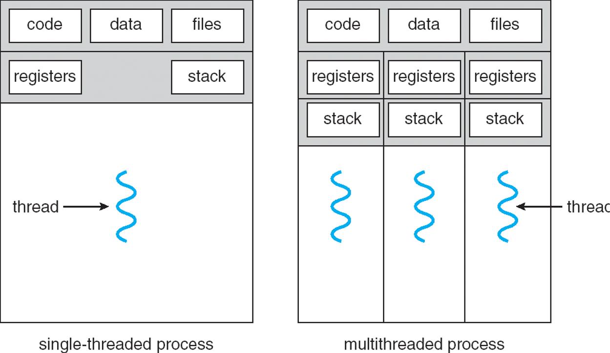

## A. Motivation & basic ideas
- using processes **are expensive** as they require:
	- creation in the `fork()` model $\implies \exists$ duplicate memory space and process context
	- context switching is required for the saving and restoration of process information

- communications between processes (IPC) $\implies$ no easy way of information passing and sharing due to processes occupying independent memory spaces

- threads were invented to *overcome the problems with using processes* as a "quick hack"

- main idea is to add in more threads of control to the same process so that multiple parts of the program could be executing at the same time, conceptually

- A *Single threaded machine* goes through the execution of code and functions sequentially
	- useful to instead execute multiple non-dependent functions at the same time (provided they are not reliant on each other's results)

### A1. Multithreading
> A **multithreaded process** is a single process can have multiple threads
- threads within the same process shares
	- **memory context:** text, data, heap
	- **OS context:** `pid`, other resources like files

**Unique information required by each thread**
1. Identification (`tid`)
2. Registers ($GPR$s and Special ones as well)
3. Stack

### A2. Benefits of using Threads
1. **Economical** $\implies$ requires much fewer resources to manage as compared to multiple processes
2. **Resource Sharing** $\implies$ the threads share the most of the resources of a process, but we don't need an additional mechanism for info sharing
3. **Responsiveness** $\implies$ multithreaded programs can appear much more responsive
4. **Scalability** $\implies$ multithreaded programs can take advantage of multiple CPUs

### A3. Problems with using Threads
1. System call concurrency
	- parallel execution of $\geq 1$ threads $\implies$ can perform parallel system calls

2. Process behaviour
	- impact on process operations
	- `fork()` a duplicate process or thread
	- if a single thread executes `exit()`, what would happen to the entire process?
	- if a single thread calls `exec()`, how about threads?

## B. Thread Models

### B1. Kernel versus User Thread Models

### B2. Hybrid Model

## C. Threads in Unix

