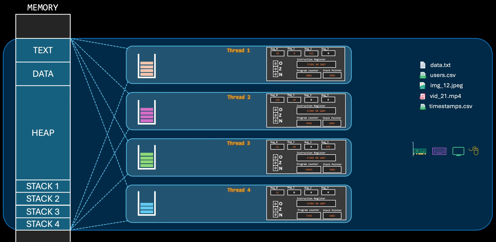
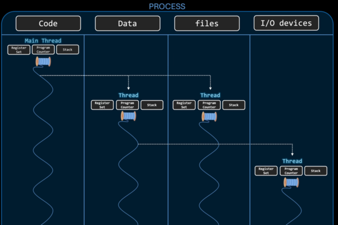
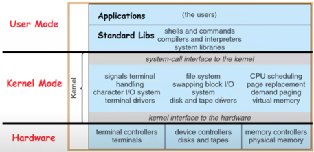
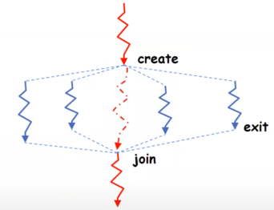

## A. Motivation & basic ideas
- using processes **are expensive** as they require:
	- creation in the `fork()` model $\implies \exists$ duplicate memory space and process context
	- context switching is required for the saving and restoration of process information

- communications between processes (IPC) $\implies$ no easy way of information passing and sharing due to processes occupying independent memory spaces

- threads were invented to *overcome the problems with using processes* as a "quick hack"
### A1. Threads
> A **thread** is a *single ==unique==* execution context.
- basic unit of CPU utilization, in other words
#### Properties
- contains $PC$, registers, execution flags, stack and memory state (i.e. immediate values from computations)
- ***executes*** on a processor core when it is *resident* (holding state of the thread) in the processor's registers
- is a ***virtual processor core*** 

- multiple threads are possible because we can multiplex in time

- thread can either be running on the physical core or saved in the Thread Control Block (see below)

- are a way to inform the OS that specific portions of a program can be concurrently executed

- threads can share a memory space with other threads of the **same process**, but they cannot share the same CPU state
	- need to save or capture CPU state (i.e. registers and stack pointer) in each individual thread $\implies$ see point A3 below
	- do not want incorrect data being access or written to
	- can read from or write to other thread's stack
	
$$
\begin{aligned}
\\
\end{aligned}
$$

> A thread is **suspended** when its state is *not resident* in the processor (i.e. not loaded)
- processor state is pointing at another thread
- $PC$ register is **not** pointing at the next instruction from the current thread (i.e. does not point to $PC+4$)
#### Process
> A **process** is a *protected address space* with $\geq 1$ threads in it.
- the *set of registers* (be it General Purpose or special ones) carry the state of a process
- can also be defined as a program in execution or in motionj (but doesn't have to always to be using the CPU)
- cannot employ concurrency within the **same process**, if we *disregard threads* $\implies$ cannot have asynchronous functionality of running two or more tasks (CPU can only be allocated to one function per process at once)
#### Motivation for Threading
- helps OS to handle multiple things at once, which is required for:
	- networking applications / servers
	- parallel programs to achieve better performance
	- programs with user interfaces for user responsiveness for doing computation
	- network and disk bound programs to hide network latency

- each singular thread can be used to *represent one task*
	- handle the slower I/O operations in a separate thread to avoid blocking other thread's progress $\implies$ masking of I/O latency
#### Thread States
- **Ready, Running or Blocked**
	- $\text{Running} \xrightarrow{\: \text{do I/O} \:} \text{Blocked} \xrightarrow{\: \text{I/O done} \:} \text{Ready} \xrightarrow{\: \text{Continue (per scheduler and ready queue)} \:} \text{Running}$
#### Other notable points
- each thread doesn't contain code, but rather points to executable code  in `.text` through the unique $PC$ value $\implies$ not dangerous because `.text` is not write-able

- main idea is to add in more threads to the *same given process* so that multiple parts of the program could be executing **at the same time**, conceptually
	- allows us to address the shortfalls of using processes and IPC

- A *single threaded machine* goes through the execution of code and functions **sequentially**
	- useful to instead execute multiple non-dependent functions at the same time (provided they are not reliant on each other's results)
### A2. Multiprogramming
- multiple jobs or processes

- **multiprogramming** ==illustrates *concurrency*== through the use of interleaving processes
	- concurrency requires **correctness and predictability** as well, regardless of what the scheduler does (should be deterministic)
	- usually done when there was only $1$ thread per process
	
#### Thread Control Block and Context Switching*
- the thread executes on the physical processor core itself and is saved in the chunk of memory, the *Thread Control Block* (TCB)

> A **context switch** involves *storing* the state of an existing process or thread, so that it can be restored and execution can be resumed at a later point in time, and then restoring a different, previously saved state
- during a **context switch**, the $PC$, `$sp` etc. are saved in the corresponding thread's TCB (so that it can continue)
	- context switch time can *vary* (should reduce to prevent thrashing) $\implies$ incurs *time and resource overhead*
		- occurs when there is a **system call** or triggering a software interrupt voluntarily
		- also can occur due to blocking I/O

	- TCB contains the entries with threads that are not running (i.e. stack, heap and register data etc.)

	- once timer (clock) is done, the $PC$ value is overwritten to jump to a new memory location which contains code needed to handle the interrupt

- interrupted process (for context switch) state needs to be *saved* somewhere (usually in RAM) and new process state to be loaded (from memory to registers) $\implies$ allow subsequent process to take over without incorrect execution
	- can use multiple register sets to save the program state $\implies$ need to ensure for $m$ processes with $n$ register sets that $m \leq n$, since $n$ is **finite**
		- actually requires only two register sets (i.e. $n = 2$) $\implies$ one for user mode and the other for kernel mode, provided that the processor supports these two modes

### A3. Multithreading 
> A **multithreaded process** is a single process can have multiple threads
- threads within the same process shares
	- **memory context:** text, data, heap
	- **OS context:** `pid`, other resources like files

- simultaneous execution of threads within the same program itself, which means:
	- scheduler is free to run threads in *any order*
	- thread may run to completion or become time sliced

- each thread should have its own **protected address space** with its own file descriptors and file systems context
	- note that file descriptors are on a process level, which is a non-negative integer value
	- address space is the visible part of the memory locations to the processor, and in turn the program as well for read or write operations using `lw` and `sw`
$$
\begin{aligned}
\\
\end{aligned}
$$
##### Unique Thread Components
1. Identification (`tid`)
2. Registers ($GPR$s and special ones like $PC$ as well)
3. Stack (which contains `$sp`) $\implies$ unique thread of execution

	

- **threads** encapsulate *concurrency*
	- enables handling of *I/O operations* and *simultaneous events* together

- **address space** encapsulates *protection environment* to keep buggy programs from crashing the program

- to make a single-threaded process into a multi-threaded one, we can make use of *system calls* to create new threads $\implies$ new threads share the address space
	- new threads can **read and write** into each other's data and stack $\implies$ allows for information and data sharing
	- usually the case for most OSes where **threads are spawned dynamically** from the `main` thread $\implies$ single to multiple threads, created at runtime as required
		

- In most systems, when terminating a main thread of a program with `exit()`, other child/spawned threads will also terminate
### A4. Parallelism*
- doing multiple things simultaneously (using *many processor cores*), i.e. **multiprocessing**
- does not require multiple tasks, but rather, can also split up one task to be done by multiple cores (through sub-tasks)
- more than one core can do some tasks truly simultaneously $\implies$ assignment of each core to a specific thread or process

- can have ***concurrency without parallelism*** in single-core multi-threaded machines, which are interleaved using time-slicing
	- CPU should be able to interleave multiple tasks, with only one task running at once

- can also have ***parallelism without concurrency*** when tasks are independent of each other and can run in isolation

- Note: If a system has $N$ cores $\implies \leq N$ **threads** can execute in parallel since threads compete for resources and the number of cores $N$ is **fixed**

##### Advantages of Parallelism
- smoothness of multitasking *less reliant* on fast interleaving execution
- *improves performance* (i.e. total time needed for task to run to completion)
### A5. Benefits of using Threads
1. **Economical** $\implies$ requires much fewer resources to manage as compared to multiple processes
2. **Resource Sharing** $\implies$ the threads share most of the resources of a process, but we don't need an additional mechanism for info sharing
	- occurs when the goal of the threads are *very much correlated*
	- i.e. having multiple request handler threads for multiple clients, using concurrency (i.e. making it feel like processes are running simultaneously through incredible speed of switching between them)

3. **Responsiveness** $\implies$ multithreaded programs can appear much more responsive
	- system calls taken to create new threads are faster than that of to create new processes

4. **Scalability** $\implies$ multithreaded programs can take advantage of multiple CPUs
### A6. Problems with using Threads
1. **System call concurrency**
	- parallel execution of $\geq 1$ threads $\implies$ can perform parallel system calls

2. **Process behaviour**
	- impact on process operations
	- `fork()` a duplicate process or thread
	- if a single thread executes `exit()`, what would happen to the entire process?
	- if a single thread calls `exec()`, how about threads?
## B. Thread Models

### B1. Kernel versus User Thread Models
#### I. User thread
- threads are implemented as a *user library*
	- a runtime system in the process will handled thread-related operations
	
- kernel does **not** need to be **aware** of threads within the process

- ==certain operations are **prohibited**== when running in user mode (user thread) like changing page table pointer, disabling interrupts, writing to kernel memory (i.e. RAM reserved solely for the use of the OS kernel) etc.

**Advantages**
- can have multithread program on any OS
- thread operations are just library calls
- user thread are more configurable and flexible $\implies$ customized thread scheduling policy

**Disadvantages**
- OS is unaware of threads, scheduling is performing at process level
	- one thread blocks results in the process being blocked and all threads within the process being blocked
	- cannot exploit the use of multiple CPUs

	
#### II. Kernel thread
- threads are implemented in OS and thread operations are handled as *system calls*

- thread-level scheduling is possible because kernel schedules by threads and not processes

- kernel may make use of threads for its own execution

- $\exists$ carefully controlled transitions between user and kernel mode $\implies$ use of syscalls, interrupts and exceptions (which happen one after another usually)
	- **syscall** occurs when a process requests for a system service like `exit()` which *exists outside the process itself*
		- caller *does not have the address* of the system function to call
		- syscalls are the APIs that are provided by the OS, to allow requests OS-specific operations

	- **interrupt** occurs through *external asynchronous* event *triggers context switch* like a timer or I/O device
	
	- **exception** is an *internal synchronous* event that *triggers context switch* like a protection violation (seg fault)
	
	- can access system using timer interrupts, I/O requests etc.
#### III. User and Kernel Modes
- kernel mode exists to ensure that programs **do not** have direct access to hardware (for security reasons)

- applications and programs run in user mode, but they must use services through API and syscalls from kernel mode to do kernel-related operations
	- in system (kernel) mode, we have access to the full address space
	- mode bit indication is dependent on the type of hardware as well
	

	

**Advantages**
- kernel can schedule on thread levels $\implies \geq 1$ thread in the same process can run simultaneously on multiple CPUs

**Disadvantages**
- thread operations are a system call so they are slower and more resource intensive
- generally less flexible
	- used by all multithreaded programs
	- if *implemented with many features*, can be expensive (and is an overkill for simpler programs)
	- if *implemented with few features*, may be inflexible for some programs

#### IV. The Syscall interface
- allows one to go from user to kernel mode, follows the hour-glass idea like IP in the network stack
- are hidden below various user-level or OS-level APIs (i.e. `libc`)
- syscalls are not standard across OSes. Each OS can have different types of system call interface (unless talking about POSIX standard)

### B2. Hybrid Model
- has **both** user and kernel threads
	- OS schedule on kernel threads only
	- user thread binds to a kernel thread

- offers great flexibility as it can limit the concurrency of any process

	

- threads started off as a software mechanism $\implies$ user space library

> **Simultaneous multi-threading:** hardware support $\exists$ on modern processes, such as the set of general purpose registers to allow threads to run natively and in parallel on the same core


## C. Threads in Unix
- `pthread` is a **standard** defined by IEEE to support most Unix variants $=$ Posix thread
- IEEE standard defines the behaviour, but not the actual implementation $\implies \therefore \:$ `pthread` can implemented as user or kernel thread
- will show a few examples to highlight the differences between process & thread only
$$
\begin{aligned}
\\\\\\
\end{aligned}
$$
### C1. Example usage
```c
#include <pthread.h>

int main() {
	pthread_t threadId;            // thread id
	pthread_attr_t threadAttrib1;    // attributes
	...
}
```

**Compilation**
- the flag `-lpthread` is required
```bash
gcc <file>.c -lpthread
```
### C2. Creation
```c
int pthread_create(
       pthread_t  *tidCreated,  // thread id
       const pthread_attr_t *threadAttributes,   // attributes     
       void *(*startRoutine) (void*),   // function ptr to funct to be exec
       void *argForStartRoutine  // arguments for the startRoutine funct
);
```
- is a C function call to create a thread (i.e. a schedulable entity) with *several arguments* of which are pointers to structures
- requires a transition from *user to kernel mode* to create the thread using a `syscall`
- returns the value of `0` for **success**, returns non-zero if got errors (which is somewhat like a normal user function)
	- return is implicit call to `pthread_exit`
### C3. Termination
```c
void pthread_exit( void *exitValuePtr );
```
- used to terminate a thread, if not the `pthread` will automatically terminate when end of `startRoutine` is reached $\implies$ no exit value
- makes the `exitValuePtr` available to any successful `join()` method
### C4. Creation + Termination Example
```c
#include <stdio.h>
#include <pthread.h>
void* sayHello(void *arg)
{
     printf("Just to say hello!\n");
     pthread_exit( NULL );
}

int main()
{
    pthread_t tid;
    pthread_create( &tid, NULL, sayHello, NULL );
    printf("Thread created with tid %lu\n", tid);
    return 0;
}
```
### C5. Process Synchronization
- can use `pthread_join()` to wait for the termination of another `pthread` $\implies$ essentially suspends execution of  calling thread until other thread terminates
	- allow parent thread to wait for child threads before moving forward
```c
int pthread_join( pthread_t threadID, void **status);
```
- returns the value of `0` for success, returns non-zero if got error
- `**status` is the exit value returned by the target `pthread`

### C6. The `fork`-`join` pattern
- depicts what usually occurs for a multi-threaded process
- main thread creates forks of sub-threads and pass arguments (and task) for them to work on $\implies$ single responsibility principle

- main thread joins the sub-threads to collect their results when they are completed (wait until all done), and outputs some result thereafter when main thread completes or terminates
	- independent relationship between main thread and its children

	

### C7. Other features
- yielding by giving up CPU voluntarily
- advanced synchronization
- scheduling policies
- binding to kernel threads

*Documentation:* `man pthread`