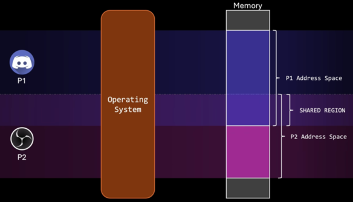
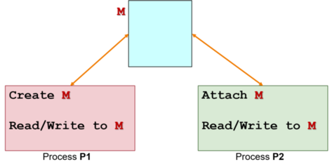
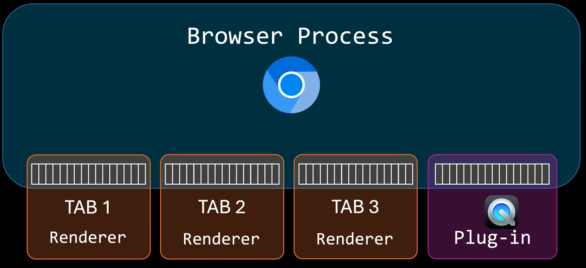
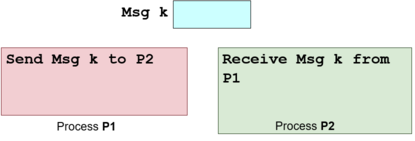
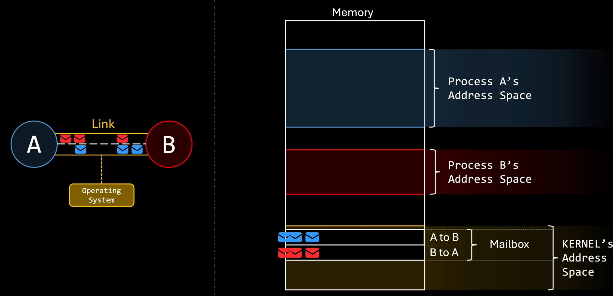
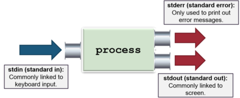

## A. Motivation
- processes can be independent (don't have any interaction between each other) or cooperating
	- are usually isolated from each other by default (i.e. isolated memory space)

- hard for cooperating processes to share info $\implies$ memory space is independent and IPC mechanisms are needed

- reasons for requiring process cooperation and hence IPC
	- **computational speedup**: good in systems supporting parallelism
	- **modularity**: division of separate functions to different processes

- IPC Mechanism
	- Shared memory
	- Message Passing

- two Unix-specific IPC mechanisms
	- Unix Pipe
	- Unix Signal

- may come across a lack of security if IPC is done without encryption or when multiple processes can access the shared memory space
## B. Communication Mechanisms
Recall that processes have the following:
- **memory region** allocated to itself (address space)
- **CPU state**
- list of **open files**
- **resources** like I/O devices

A process is an entire context in which a program operates in.
### B1. Shared Memory
- process $P_1$ creates shared memory region $M$
	- usually the OS will allocate separate address spaces for each process in execution

- process $P_2$ attaches memory region $M$ to its **own memory space**
- $P_1$ and $P_2$ can communicate using memory region $M$
	- any memory writes to the region can be seen by all the other parties
	- $M$ is a shared memory region and behaves very similarly to normal memory region

	

- same model is applicable to multiple processes sharing the same memory region
	- data in the shared memory region is no longer managed by the OS, but rather, the $n$ processes that share the region
	


- possible memory model is one that of producer-consumer $\implies$ need to agree how data is structured

- must ensure that no two processes are performing a write operation at once $\implies$ data corruption
##### Example: Chromium Browsers

##### Advantages
- **Efficient:** only the initial steps, the create and attach shared memory region involves the OS
	- very fast communications
- **Easy to use:** shared memory region $M$ behaves similarly to normal memory space
##### Disadvantages
- **Synchronization:** shared resource but we need to synchronize access
- **Harder to implement**
- Error prone

##### Steps for usage
1. Create or locate a shared memory region $M$
2. Attach $M$ to the process memory space
3. Read from or write to memory space $M \implies$ values are visible to all processes that share $M$
4. Detach $M$ from memory space after use
5. Destroy $M$ as only $1$ process is required to do this (can occur only if $M$ is not attached to any other processes)

**Master Program**
```c
#include <stdio.h>
#include <stdlib.h>
#include <sys/ipc.h>
#include <sys/shm.h>

int main()
{
    int shmid, i, *shm;

	// step 1 -> create shared memory
    shmid = shmget( IPC_PRIVATE, 40, IPC_CREAT | 0600);
    if (shmid == -1){
        printf("Cannot create shared memory!\n");
        exit(1);
    } else
        printf("Shared Memory Id = %d\n", shmid);

		// step 2 -> attach shared memory
	    shm = (int*) shmat( shmid, NULL, 0 );

	    if (shm == (int*) -1){
	        printf("Cannot attach shared memory!\n");
	        exit(1);
	}
	shm[0] = 0;
    while(shm[0] == 0){
        sleep(3);
    }
    
    for (i = 0; i < 3; i++){
        printf("Read %d from shared memory.\n", shm[i+1]);
    }

	// steps 4 and 5 -> detach and destroy M
    shmdt( (char*) shm);
    shmctl( shmid, IPC_RMID, 0);
    return 0;
}
```

**Slave Program**
```c
#include <stdio.h>
#include <stdlib.h>
#include <sys/ipc.h>
#include <sys/shm.h>
int main()
{   
	int shmid, i, input, *shm;
    printf("Shared memory id for attachment: ");
    scanf("%d", &shmid);
    
    shm = (int*)shmat( shmid, NULL, 0);
    if (shm == (int*)-1) {
        printf("Error: Cannot attach!\n");
        exit(1);
    }

    for (i = 0; i < 3; i++){
        scanf("%d", &input);
        shm[i+1] = input;
    }

    shm[0] = 1;
    shmdt( (char*)shm );
    return 0;
}
```
### B2. Message Passing
- process $P_1$ prepares a message $k$ and sends it to $P_2$
- $P_2$ receives $k$ 
- note that message sending and receiving are usually provided as system calls

- unlike shared memory, the processes are **isolated** (don't have any shared memoory space)

- used in networking client-server model (socket interface)
	- client and server are processes that run inter- or intra-host
	- communication doesn't always require a network
#### Properties
1. Naming $\to$ identify the other party in the communication
2. Synchronization $\to$ behaviour of sending and receiving operations


- Message $k$ has to be stored in kernel memory space
- all send and receive operations need to go through the OS via a system call

| Direct Comms                                                                                                                                                                                                       | Indirect Comms                                                                                                                                                                                                                                   |
| ------------------------------------------------------------------------------------------------------------------------------------------------------------------------------------------------------------------ | ------------------------------------------------------------------------------------------------------------------------------------------------------------------------------------------------------------------------------------------------ |
| - Sender or receiver of message explicitly name the other party<br><br>- format `send(P2, msg)` and `receive(P1, msg)`<br><br>- one link per pair of comms processes, need to know the identity of the other party | - Message is sent or receiver from message storage, a.k.a. **`port`** (⚠️ *msg not sent directly to processes*)<br><br>- format `send(MB, msg)` and `receive(MB, msg)`<br><br>- possible for one mailbox to be shared amongst multiple processes |
#### Indirect Communications Example

- Both $B$ and $A$ have mailboxes for specific senders $\implies$ can be implemented using FIFO / FCFS queues
- another variant is to have a more generic **listening port**, whereby the mailbox accepts process data from any other process on the system
#### Pros
- *portable:* easily implemented on different processing environment 
	- processes don't even need to be on the same machine to communicate with each other (port $X$ on host $A$ can communicate with port $Y$ on host $B$) $\implies$ requires river level programming for hardware like Network Interface Cards

- *easier synchronization:* when the synchronous primitive is used, both the sender and receiver are implicitly 

#### Cons
- *inefficient* as it requires OS intervention
	- requires the use of system calls for communication establishment $+$ each time one wants to send or receive data via mailbox / port

- *harder to use* as the message is usually limited by size and/or format
### B3. Unix Pipe
> **Piping:** Unix shell provides the `|` symbol as a "link" for input and output channels of one process to another 
- output of command $A$ is passed in as an input for command $B$
- *unidirectional point to point scheme* for the transfer of raw bytes

- Unix pipe is one of the earlier IPC mechanisms
	- it is a communication channel with two ends (write into and read from), which can be shared between $2$ processes and has a producer-consumer relationship
	- piping in shell is achieved using the mechanism internally

- Behaviour $\implies$ anonymous FIFO file
- Semantic $\implies$ synchronous
- Variants include multiple reader / write and duplex
##### Standard Communication Channels

##### Semantic
- pipe functions as circular bounded byte buffer with implicit synchronization
	- writers wait when buffer full
	- readers wait when buffer empty

- has variants which can have multiple readers and writers
	- pipes may be half-duplex and unidirectional: one write end and one read end
	- pipes may be full-duplex and bidirectional: can use any end for read/write operations
##### System Calls
```c
#include <unistd.h>
int pipe(int fd[]);
```
- returns the value of `0` for success, returns non-zero if got error
- an **array of file descriptors** are returned
	- `fd[0]` $\implies$ reading end
	- `fd[1]` $\implies$ writing end

	

```c
#define READ_END 0
#define WRITE_END 1
#include <stdio.h>
#include <stdlib.h>
#include <sys/ipc.h>
#include <sys/shm.h>
#include <string.h>
#include <unistd.h>

int main() {
    int pipeFd[2], pid, len;
    char buf[100], *str = "Hello There!";

    pipe(pipeFd);
    if ((pid = fork()) > 0) { /* parent proc */
        close(pipeFd[READ_END]);
        write(pipeFd[WRITE_END], str, strlen(str) + 1);
        close(pipeFd[WRITE_END]);
    } else { /* child proc */
        close(pipeFd[WRITE_END]);
        len = read(pipeFd[READ_END], buf, sizeof buf);
        printf("Proc %d read: %s\n", pid, buf);
        close(pipeFd[READ_END]);
    }
}
```
##### Other Unix Pipes
- possible to attach and change the standard communications channels to one of the pipes $\implies$ redirect `stdin` / `stdout` from one program to another
	- `dup()`
	- `dup2()`
### B4. Unix Signal
- is a form of IPC
	- asynchronous notification regarding an event that is sent to a process or thread
	
- recipient of the signal must handle signal via:
	- default set of signal handlers OR
	- user supplied handler (which is applicable for some signals only)

- common signals include: `kill`, `stop`, `continue`, memory error, arithmetic error
```c
#include <stdio.h>
#include <signal.h>
#include <unistd.h>
#include <stdlib.h>

void myOwnHandler( int signo )
{    
    if (signo == SIGSEGV){        
        printf("Memory access blows up!\n");
        exit(1);    
    }
}

int main(){    
    int *ip = NULL;    

	// SIGSEGV -> the code handles this to prevent segfaults
    if (signal(SIGSEGV, myOwnHandler) == SIG_ERR)
        printf("Failed to register handler\n");

    *ip = 123;  
    return 0;
}
```