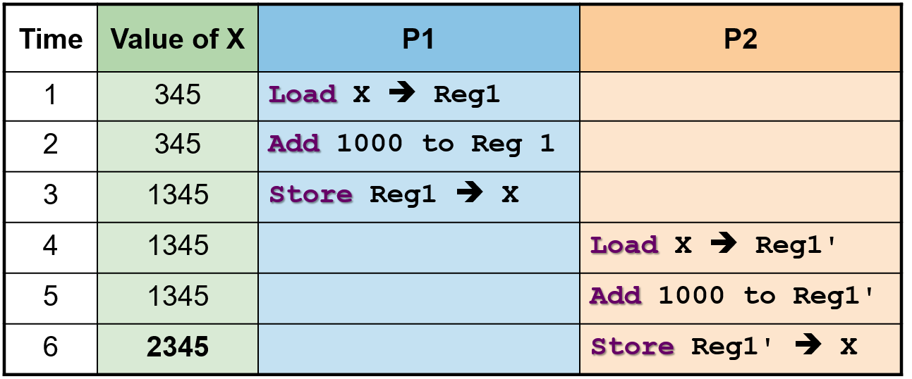
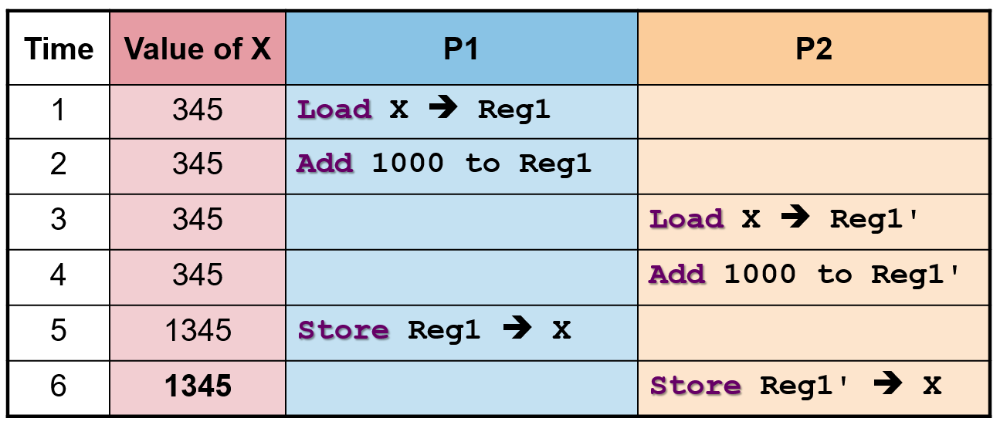

## A. Race Condition
- **concurrency** is the technique used by processors (alongside CPU scheduling) that distributes computing resources amongst executable entities
	- creating of the illusion that processes are all running at once

- however, when $\geq 2$ processes execute concurrently in *interleaving fashion* or share modifiable resources $\implies$ can cause synchronization problems
	- whereby processes are **no longer independent** and require interaction

- execution of a *single sequential process* is **deterministic in nature**, as the repeated execution yields the same result
	- each line of code **doesn't** always **correspond to only one instruction** when compiled ($\geq 1$ instruction per line of code)
	- most operations in source code, i.e. declaration $+$ assignment requires multiple CPU steps
	```c
	int c = a + b;
	```

- Race Conditions: execution of concurrent process **may not be deterministic** and the outcomes depends on the order which the shared resource is accessed or modified
	- $P_1$ and $P_2$ modify the same variable value

```c
X = X + 1000
```
1. `Load X` $\implies$ `register1`
2. `Add 1000` to the variable stored in `register1`
3. `Store register1` $\implies$ `X`



- execution of two concurrent in interleaving fashion
	- share modifiable resources
	- can cause synchronization problems

#### Solution
- incorrect execution is due to unsynchronized access to shared modifiable resource
- solution outline $\implies$ designate code segment *with race condition* as critical section and only one process can execute in the critical section
## B. Critical Section
#### Properties of correct Critical Section
- **Mutual Exclusion:** if process $P_i$ is executing in critical section, then all the process are prevented from entering the critical section
- **Progress:** if no process is in a critical section, then one of the waiting processes should not be granted access
- **Bounded Wait:** After process $P_i$ requests to enter critical section, then $\exists$ upper bound to \# times other processes can enter the critical section before $P_i$
- **Independence:** process not executing in critical section should never block other processes

#### Symptoms of Incorrect Synchronization
1. **Deadlock:** if all processes are blocked $\implies$ there is no progress
2. **Livelock**: is a deadlock avoidance mechanism, whereby processes keep changing their state to avoid deadlock, but *no progress is made*
3. **Starvation:** processes are blocked forever

#### Implementation of Critical Section
1. Assembly-level implementation by the processor
2. High-level language implementation which uses programming constructs
3. High-level abstractions which provide additional useful features and are commonly implemented by assembly level mechanisms
## C. Implementations of Critical Sections

## D. Classical synchronization problems
